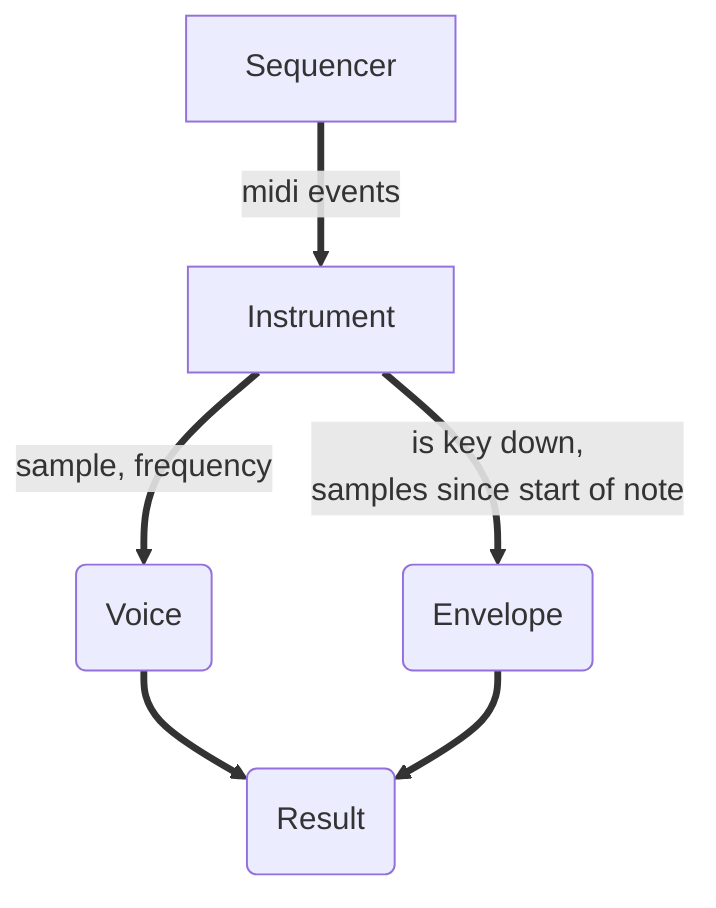

```mermaid
flowchart TD

s[Sequencer]
i[Instrument]
v(Voice)
e(Envelope)
r(Result)

s ==> |midi events| i
i ==> |sample, frequency| v
i ==> |is key down,\nsamples since start of note| e

v ==> r
e ==> r


```