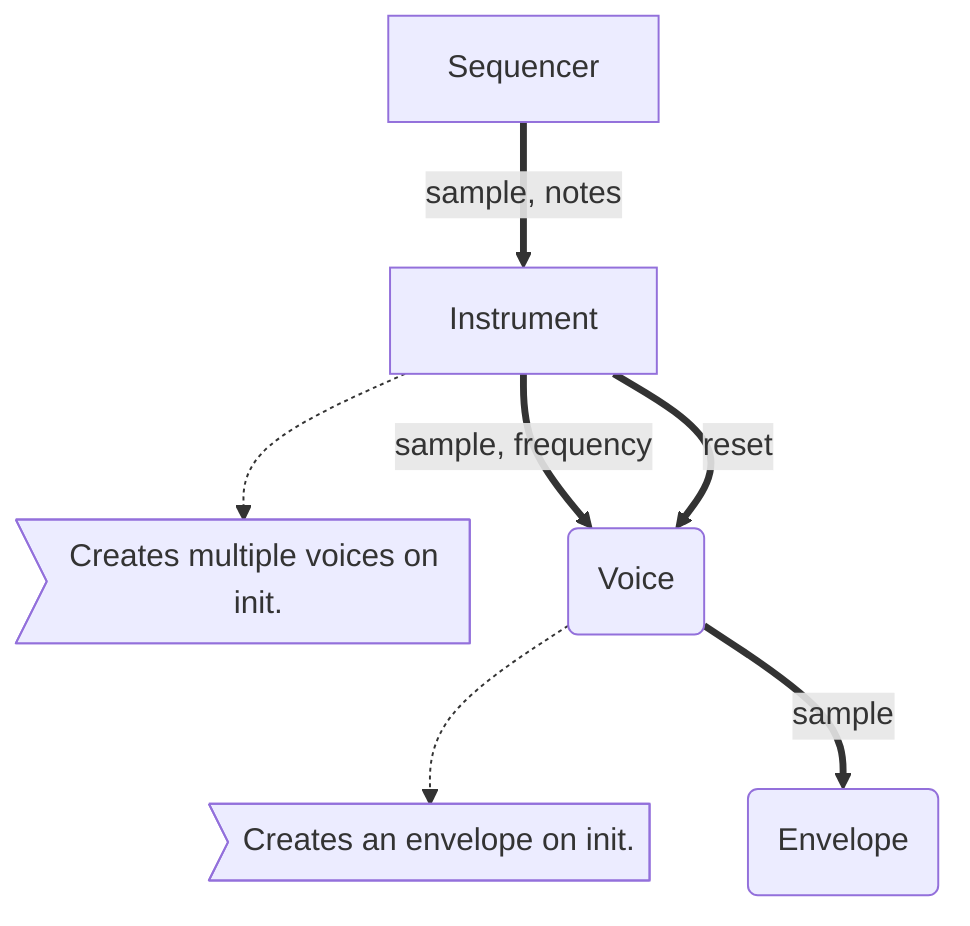

```mermaid
flowchart TD

s[Sequencer]
i[Instrument]
v(Voice)
e(Envelope)

i -.-> 1>Creates multiple voices on init.]
v -.-> 2>Creates an envelope on init.]

s ==> |sample, notes| i
i ==> |sample, frequency| v
i ==> |reset| v
v ==> |sample| e


```